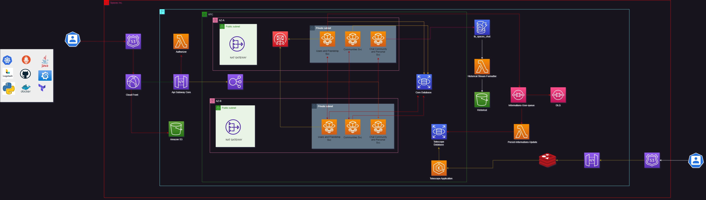

 

# Spaces User and Friendship Service 

Repositório que versiona os códigos dos serviços de Usuário e Amizade do projeto Spaces.


## Arquitetura do projeto:


## Pré-requisitos
 - Java 17
 - Docker
 - Minikube (Caso queira rodar localmente o Kubernetes)
 - Terraform (caso queira executar testes locais de toda funcionalidade)
 - AWS CLI (caso queira executar testes locais de toda funcionalidade usando localstack)
 - Localstack (caso queira executar testes locais de toda funcionalidade usando localstack)
 - Gradle

## Executando localmente
Para executar localmente, basta executar o comando `./gradlew bootRun` na raiz do projeto.

## Executando testes localmente
Para executar testes localmente, basta executar o comando `./gradlew test` na raiz do projeto.


## Estrutura de multi módulos com Clean Architecture

```
├── spaces-user-svc
│   ├── build.gradle
│   ├── domain
│       ├── build.gradle
│   ├── infrastructure
│       ├── build.gradle
│   ├── application
│       ├── build.gradle
```

